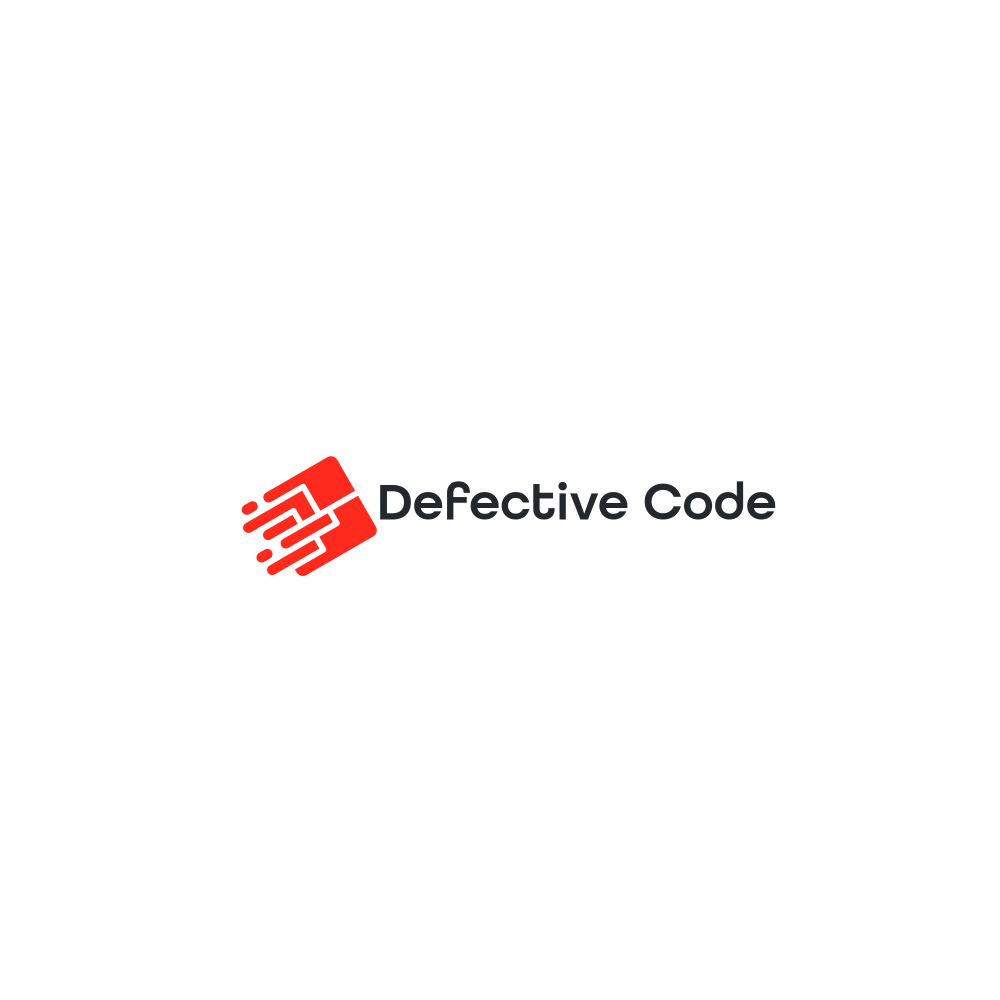

<p align="center"></p>

<p align="center">
    <a href="https://packagist.org/packages/defectivecode/link-sharer">
        
    </a>
    <a href="https://packagist.org/packages/defectivecode/link-sharer">
        
    </a>
    <a href="https://packagist.org/packages/defectivecode/link-sharer">
        
    </a>
</p>

# Introduction

This package simplifies the process of adding share links to your Laravel application. A list of currently supported services can be found in the table below. We are constantly striving to expand our offerings and welcome contributions from the community. If you wish to add new services, please feel free to submit a pull request!

A share link is a URL that enables users to effortlessly share content from your website or application on various social media platforms or through other communication channels. It is composed of a base URL for a specific social media platform, combined with query parameters that define the content to be shared. These parameters typically include the URL of the page being shared and a pre-populated message or description. By embedding these share links in HTML anchor tags `<a>`, users are offered a smooth experience when sharing your content across different platforms. As illustrated in the examples, the share links enable users to share a blog post on Twitter, Facebook, and Telegram with a predefined message. This open-source package provides a convenient solution for generating share links, broadening the exposure and visibility of your content on popular social media platforms.

This package leverages Laravel's blade components to offer a quick and efficient way to integrate share links into your Laravel application. Blade components provide an expressive, clean syntax that makes it easy to register and render share links, improving the user experience for sharing your content across various platforms. Let's dive into an example to get started.

## Example

```html
<x-link-sharer service="twitter" text="Share me!" url="https://www.defectivecode.com" class="p-4">
    <!-- Your HTML code here to control the look and feel of the share button -->
    <span class="bg-blue-500 hover:bg-blue-700 text-white font-bold py-2 px-4 rounded">Click me!</span>
</x-link-sharer>
```

# Documentation

You may read the [documentation on our website](https://www.defectivecode.com/packages/link-sharer).

# Support Guidelines

Thank you for using our open source package. Your understanding of the following support guidelines is crucial to ensure a smooth experience with our project:

## Community Driven Support

As an open-source project, our primary support mechanism is our vibrant community. For general questions or troubleshooting, we recommend turning to community forums, discussion boards, or our project's dedicated channels.

## Bugs, and Feature Prioritization

The reality of managing an open-source project means we can't address every reported bug immediately. However, we're committed to the project's integrity. We prioritize bug fixes in the following order:

### 1. Bugs Affecting Our Paid Products

Bugs that impact our paid products will always be our top priority. In some cases, we may only address bugs that affect us directly.

### 2. Community Pull Requests

If you've identified a bug and have a solution, please submit a pull request. After issues affecting our products, we give the next highest priority to these community-driven fixes. Once reviewed and approved, we'll merge your solution and credit your invaluable contribution.

### 3. Financial Support

For bugs that don't fall into the above categories but need urgent attention, you have the option to financially support their resolution. Using the order form linked with every open issue, you can contribute to the bug's resolution. We prioritize such bugs based on the dollar amount of support received.

## 3. Community Contributions

Open source thrives when its community is active. Even if you're not fixing bugs, consider contributing through code improvements, documentation updates, tutorials, or by assisting others in community channels. We highly encourage everyone, as a community, to help support open-source work.

_To reiterate, DefectiveCode will prioritize bugs based on how they impact our paid products, community pull requests, and the financial support received for individual issues. We appreciate your patience and contributions, ensuring the project's ongoing success._

# License

The MIT License (MIT). Please see [License File](LICENSE.md) for more information.
